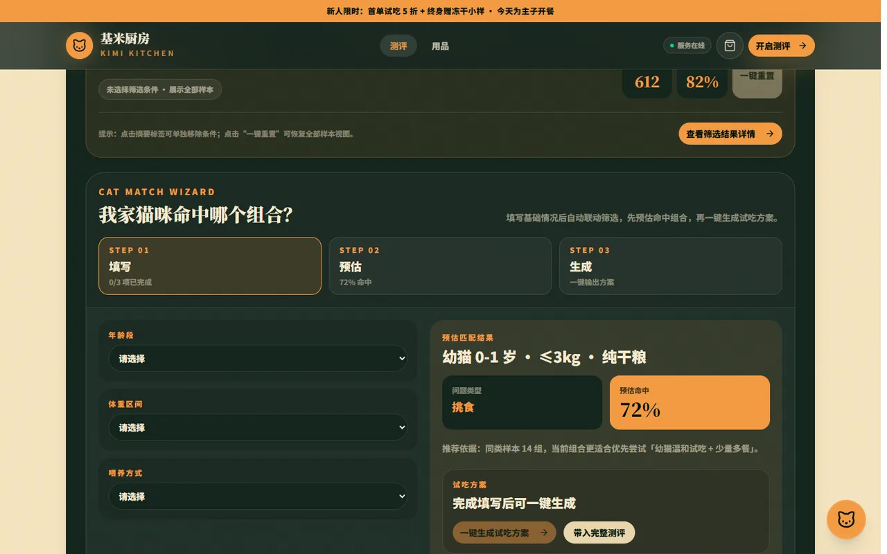
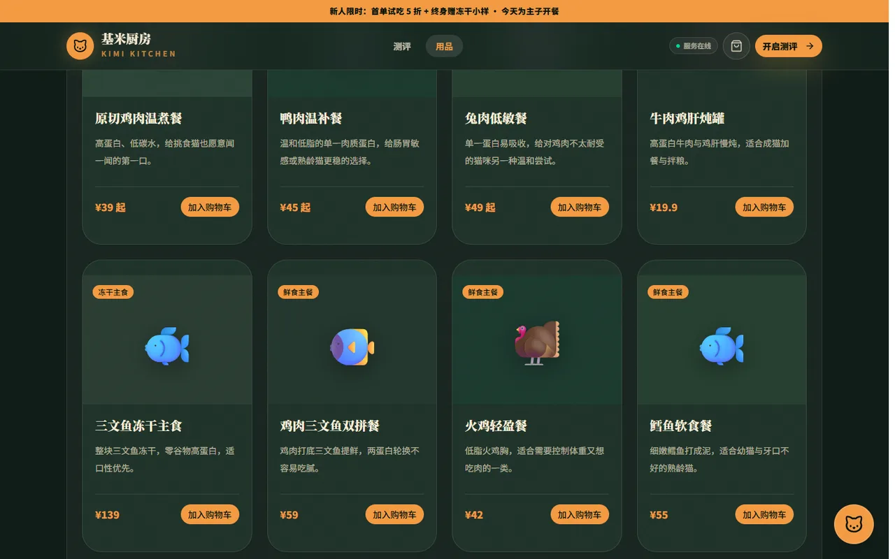
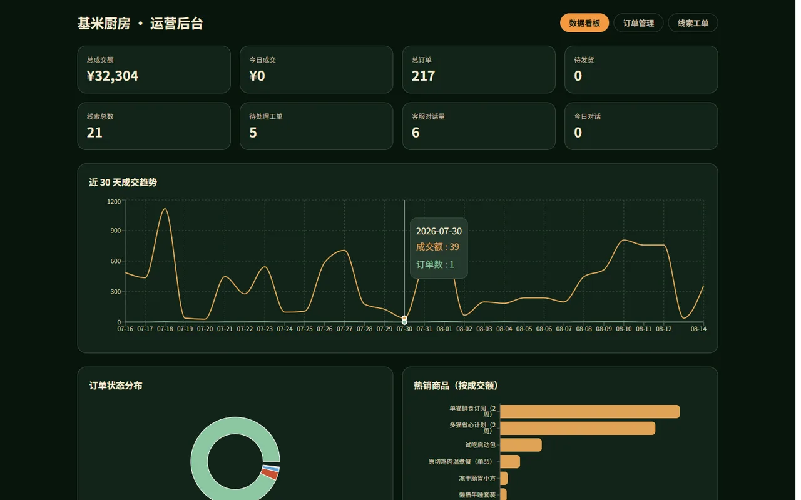

# 基米厨房 · 宠物鲜食品牌全栈项目

> 中文宠物鲜食（DTC）品牌一体化项目：**品牌官网 + 智能客服（RAG + 知识图谱）+ 运营后台**。
> 围绕「先测评 → 再试吃 → 再订阅」的高转化漏斗，面向可对外演示的 MVP。

[](https://github.com/tjay2891002-sketch/siamese-cat-pet-brand/actions/workflows/ci.yml)     

## 系统组成

| 模块 | 技术 | 说明 |
|---|---|---|
| 品牌官网 | React 19 / Vite / Tailwind 4 / shadcn-ui | 暗调私厨风格落地页：测评漏斗、用品商城、套餐、透明厨房、FAQ、购物车 |
| 智能客服组件 | React + SSE 流式 | 可拖拽悬浮按钮、流式渲染、产品卡片、猫咪档案联动、转人工留资 |
| 薄后台 | 零依赖 Node（原生 http） | API 代理（密钥隔离）、图谱事实注入、线索工单、管理端 API、webhook 通知 |
| 对话与知识库 | Dify（Docker 自托管） | 混合检索 + Rerank，结合知识库 RAG 生成回答 |
| 知识图谱 | Neo4j 5（Docker） | 画像 → 问题 → 方案 → 产品 推理链，组合画像节点 |

## 功能亮点

- **测评漏斗**：填写猫咪画像 → 生成推荐方案 → 一键生成试吃清单。
- **用品 + 套餐**：首页/用品页按「主食/零食/用品」手风琴展开，订阅套餐折叠浏览；购物车支持加购与结算留资。
- **线索自动化**：测评、咨询、购物车结算统一通过薄后台落库，联动飞书群回 + 飞书多维表格。
- **AI 客服**：读取本地测评档案作为会话变量，薄后台做 Neo4j 图谱推理 + Dify 知识库检索，流式渲染产品卡。
- **运营后台**：`/#/admin` 看板、订单、工单状态管理，需 `ADMIN_TOKEN`。

## 演示截图

### 官网首页


### 测评页


### 用品页


### AI 客服


### 运营后台


## 架构

```
浏览器
  ├─ 官网页面（React）
  └─ 聊天组件 ──→ /api（vite 代理）──→ 薄后台 :8787
                                        ├─ 图谱事实注入 ← Neo4j :7474
                                        ├─ 转发对话 ──→ Dify :80（知识库 RAG + 档案变量）
                                        │                └─ DeepSeek / 硅基流动 API
                                        ├─ 线索工单 → server/data/leads.jsonl → 企微/飞书 webhook
                                        └─ 管理端 API ← /#/admin 运营后台
```

一次问答的完整链路：

1. 前端读取 localStorage 里的测评档案（猫名/年龄/体重/挑食程度），作为会话变量随问题发出
2. 薄后台查询 Neo4j：档案命中组合画像节点，推理出典型问题与推荐方案（含历史适应率）
3. 推荐事实 + 相关 FAQ 注入 `graph_facts`，连同问题转发给 Dify
4. Dify 做知识库检索（混合检索 + Rerank），生成回答
5. 回答里的 `[PRODUCT:id]` / `[HUMAN]` 标记由前端渲染为产品卡片 / 人工留资卡（薄后台有标记兜底，不依赖模型自觉）

## 快速开始

前置：Docker Desktop（运行 Dify 与 Neo4j）、Node 22+、pnpm。

```bash
# 1. 启动 Dify（本仓库不含 Dify 源码，先克隆到项目根目录下的 dify/）
git clone --depth 1 https://github.com/langgenius/dify.git dify
cd dify/docker && docker compose up -d     # 首次会拉取镜像，耗时较长
cd ../..                                   # 回到项目根目录，继续下面步骤

# 2. 启动 Neo4j
docker start neo4j-ninelives

# 3. 配置环境变量（项目根目录，参考 .env.example）
cp .env.example .env

# 4. 一键启动前后端（推荐）
pnpm dev:all        # 同时启动薄后台 :8787 + 官网 :5173

# 或者分开启动
pnpm server         # :8787
pnpm dev            # :5173
```

- 官网：`http://localhost:5173/`
- 运营后台：`http://localhost:5173/#/admin`（口令 = `.env` 的 `ADMIN_TOKEN`）
- Dify 控制台：`http://localhost/`；Neo4j Browser：`http://localhost:7474/`

## 测试

项目使用 Vitest（已内置为 devDependency）。将推荐匹配、购物车结算等核心规则抽成纯函数以利于单测；后端提供集成测试，在**隔离环境**（临时数据目录、关闭飞书/Dify）中验证健康检查与线索落库。

```bash
pnpm test           # 运行全部测试（单元 + 后端集成）
pnpm test:watch     # 监听模式
pnpm exec vitest run tests/server.integration.test.ts   # 只跑后端集成
```

测试文件位于 `tests/`，共 4 个文件、21 个用例，覆盖：

- 推荐矩阵匹配（筛选 / 精确命中 / 规则推荐）
- 购物车合计与结算消息
- 站点数据完整性（推荐矩阵取值合法、商品/套餐 id 唯一、价格为正）
- 后端集成（`/api/health`、`/api/leads` 落库与鉴权）

## 压测

`scripts/load-test.mjs` 为轻量压测脚本（零依赖，基于原生 http），统计成功率、吞吐、p50/p95/max 延迟。

```bash
# 打健康检查：30 并发、6 秒
pnpm load-test http://localhost:8787 30 6

# 同时打线索接口（会写入压测线索，谨慎用于正式数据）
pnpm load-test http://localhost:8787 20 5 --with-leads
```

本机实测（`/api/health`，30 并发 / 6 秒）：请求 44,126，成功率 100%，吞吐约 7,352 req/s，p50=4ms、p95=6ms。

> 该数据为本机基准，仅反映薄后台在静态 MVP 下的伸缩性，不代表线上容量承诺。

## 开发命令汇总

| 命令 | 说明 |
|---|---|
| `pnpm dev` | 仅前端（Vite） |
| `pnpm server` | 仅后端（薄后台） |
| `pnpm dev:all` | 前后端一键启动 |
| `pnpm seed` | 写入演示种子线索（幂等） |
| `pnpm test` | 运行全部测试 |
| `pnpm lint` | ESLint |
| `pnpm build` | 类型检查 + 构建 |
| `pnpm load-test` | 轻量压测 |

## 目录结构

```
src/
  components/chat/      智能客服组件（ChatWidget / useDifyChat / HumanRequestCard）
  components/Cart.tsx   购物车抽屉（加购、结算留资）
  lib/                  纯逻辑模块（recommendation / cart / leads）
  pages/Admin.tsx       运营后台（看板 / 订单 / 工单）
  data/site.ts          品牌数据层（产品、套餐、推荐矩阵、FAQ 的单一事实源）
  hooks/                自定义 hooks（useBackendHealth 等）
tests/                  Vitest 单测 + 后端集成测试
scripts/
  dev-all.mjs           一键启动前后端
  seed.mjs              演示种子数据
  load-test.mjs         轻量压测
knowledge-base/         Dify 知识库文档 + graph-schema.md
docs/DEVELOPMENT_NOTES.md  本次迭代改动、做法与压测记录
server/
  index.mjs             薄后台入口（代理 / 线索 / webhook / health）
  admin.mjs             管理端 API（订单、看板、工单状态）
  feishu.mjs            飞书线索同步 / 群推送（可选，未配置静默跳过）
  graph/seed.mjs        图谱建库（从 site.ts 与 FAQ 自动提取，幂等可重跑）
  graph/query.mjs       图谱查询（画像推理 + 意图抽取 + 体重归一）
  mock/gen-orders.mjs   模拟订单生成器（固定种子，与商品数据自洽）
```

## 运营命令

```bash
node server/graph/seed.mjs       # 知识库文档/site.ts 更新后重跑图谱建库
node server/mock/gen-orders.mjs  # 重新生成模拟订单
pnpm seed                        # 填充演示线索
```

## 安全设计

- 密钥仅存于服务端 `.env`（已 gitignore），前端只接触同源 `/api`；后端读取 `.env` 后支持以环境变量覆盖，便于 CI、测试与部署注入。
- 管理端接口全部要求 `ADMIN_TOKEN` 口令。
- 图谱注入、线索上报均为失败静默降级，不影响主对话流程。
- 前端后端连接状态仅在本地/局域网显示，外部隧道/公网自动隐藏，避免演示时误显「服务离线」。

## 用品与飞书接入（可选）

- **用品栏目**：首页 `#shop` 已按「主食 / 零食 / 用品」分类展示；用品作为 `Product` 节点进 Neo4j，客服图谱查询与知识库均可推荐用品。
- **飞书群机器人（方式A）**：在群设置 → 群机器人 → 自定义中获取 Webhook，填入 `.env` 的 `NOTIFY_WEBHOOK_URL`，转人工工单会自动提醒。
- **飞书多维表格（方式B）**：在飞书开放平台建自建应用，拿到 `FEISHU_APP_ID / FEISHU_APP_SECRET / FEISHU_BITABLE_APP_TOKEN / FEISHU_BITABLE_TABLE_ID`，线索会自动写入表格。表格字段需包含：时间 / 类型 / 猫名 / 年龄 / 体重 / 挑食 / 目标 / 联系方式 / 诉求 / 对话。
- **飞书线索推送（方式C）**：用方式B同款自建应用，在飞书建「你 + 机器人」的群，把群的 `FEISHU_CHAT_ID` 填入 `.env`，官网新线索会自动推送到该群。
- 三者均可单独启用；未配置时静默跳过，不影响主流程。

## 路线图

- [ ] 容器化部署：`Dockerfile` + `docker-compose.yml`（前端静态 + 后端 + Neo4j）
- [x] README 截图补充与封面排版
- [ ] 知识库扩充（报价 / 过敏 / 多猫 / 喂食量；配送与售后已在 02 / 03 篇）
- [ ] Neo4j 图谱可视化（推荐理由 / 关联商品）
- [x] CI 纳入集成测试（workflow 在所有分支触发，覆盖 lint / type check & build / test）
- [x] 上 GitHub 前安全收尾（密钥扫描、确认不提交 `.env` / `leads.jsonl`）

## 已知边界

- 知识库中售后/配送政策为拟定稿，正式商用前需品牌方确认
- 订单数据为模拟生成；真实交易链路（微信小店/支付）未接入
- 转人工为工单式（异步留资 + webhook 通知），非实时坐席
- 移动端兼容：主题色已做 hex 回退（旧浏览器内核不支持 oklch/color-mix）

## 相关文档

- 开发记录（改动 / 做法 / 压测）：[docs/DEVELOPMENT_NOTES.md](./docs/DEVELOPMENT_NOTES.md)
- 项目复盘（做了什么 / 架构 / 难题 / 优化路线）：[docs/PROJECT_RETROSPECTIVE.md](./docs/PROJECT_RETROSPECTIVE.md)
